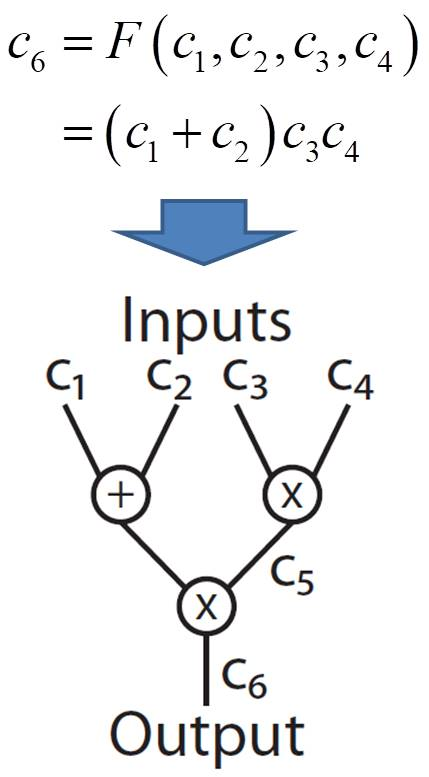

# 6. zk-SNARK의 예: Groth16 프로토콜 (2)
> 작성자: 장재혁, [GIST 블록체인 인터넷 경제 연구센터 (센터장 이흥노)](https://infonet.gist.ac.kr/?page_id=6711)
>
> This work was created through a joint research with Onther Co., LTD., and supported by a grant-in-aid of Institute of Information & Communications Technology Planning & Evaluation (IITP), Republic of Korea.
>
> 이 글은 정보통신기획평가원(IITP)에서 연구비 지원을 받아 (주)온더와의 공동연구를 통해 만들어진 결과물이다.

## 연산을 분해한다?

Groth16에서는 program analysis라는 방법과 QAP를 사용하여 연산 프로그램 $$f\left( u \right)$$의 전 계산 과정을 분해한다. Program analysis는 $$f\left( u \right)$$의 계산 과정을 사칙연산 게이트(gate)들과 이들을 잇는 선(wire)로 치환하는 과정이다. 게이트와 선으로 $$f\left( u \right)$$를 시각화한 도해를 "써킷(circuit)"이라 부른다 (그림 6). 그 후, QAP의 역할은 써킷을 구성하는 모든 게이트와 선들을 "다항식(polynomial)"과 "계수(coefficient)"의 형태로 변환하는 것이다 (그림 7). 각각의 다항식에는 써킷의 각각의 선들과 게이트들간의 연결 관계 (어떤 선이 어떤 게이트와 연결되어 있는지)에 관한 정보들이 저장되어 있다. 따라서 다항식의 총 개수는 선의 개수와 연관이 있다. QAP의 계수들은 선에 저장된 중간 계산 값들을 담고 있다. 

[width="1.32175in" height="2.39394in"}
그림 6 Program analysis를 통해 4입력 함수 $$F\left( [[x}_[1}},[[x}_[2}},[[x}_[3}},[[x}_[4}} \right)=\left( [[x}_[1}}+[[x}_[2}} \right)[[x}_[3}}[[x}_[4}}$$를 써킷으로 변환한 모습 (써킷 변환 방법은 유일하지 않다). 여기서 4개의 입력 값 $$[[c}_[1}}$$, $$[[c}_[2}}$$, $$[[c}_[3}}$$, $$[[c}_[4}}$$와 중간 계산 값 $$[[c}_[5}}$$는 증명자만이 알고 있는 비공개 정보 일 수 있다. 출력 값 $$[[c}_[6}}$$은 일반적으로 공개된 정보이다.

[width="3.63926in" height="3.01515in"}
그림 7 써킷을 다항식과 계수로 변환하는 과정의 예.

## Quadratic Arithmetic Program?

QAP는 써킷의 정보를 담고 있는 다항식들과 계수들의 집합이다. 그림 7은 써킷의 구조를 다항식들로 변환하는 과정의 예이다. 다항식 변환 과정은 다음과 같다: 

1)  각 게이트에 임의의 값을 할당한다. 이 값들을 "근"이라 부른다
    (그림에서 $$[[r}_[5}}$$와 $$[[r}_[6}}$$).

2)  모든 근을 zero로 갖는 다항식 $$t\left( x \right)$$를 정의한다.

3)  각각의 선에 대응되는 3개의 다항식 $$[[v}_[k}}\left( x \right)$$,
    $$[[w}_[k}}\left( x \right)$$, $$[[y}_[k}}\left( x \right)$$를
    정의한다 ($$k$$는 선 번호).

4)  모든 $$k$$번 선에 대해, 어느 게이트의 왼쪽 입력이면
    $$[[v}_[k}}\left( x \right)$$에서 해당 근을 대입 하였을 때의
    출력을 1로 정의한다 (그림에서 $$[[v}_[3}}\left( [[r}_[5}}
    \right)=1$$). 그렇지 않으면 출력을 0으로 정의한다 (그림에서
    $$[[v}_[4}}\left( [[r}_[5}} \right)=0$$). 마찬가지로 각 선이
    어느 게이트 $$r$$의 오른쪽 입력이면, $$[[w}_[k}}\left( r
    \right)=1$$로 정의한다, 그렇지 않으면 $$[[w}_[k}}\left( r
    \right)=0$$으로 정의한다. 마찬가지로 각 선이 어느 게이트 $$r$$의
    출력이면, $$[[y}_[k}}\left( r \right)=1$$로 정의한다. 그렇지
    않으면 $$[[y}_[k}}\left( r \right)=0$$으로 정의한다.

5)  마지막으로, 과정 4)에서 정의한 $$[[v}_[k}}\left( x \right)$$,
    $$[[w}_[k}}\left( x \right)$$, $$[[y}_[k}}\left( x \right)$$의
    표본(sample)들을 토대로 보간법(interpolation)을 사용하여,
    $$[[v}_[k}}\left( x \right)$$, $$[[w}_[k}}\left( x \right)$$,
    $$[[y}_[k}}\left( x \right)$$ 연속함수 형태의 다항식들로 만든다.

QAP의 다항식들에는 써킷의 연결구조가 저장되어 있다. QAP의 계수들(그림 6의 $$[[c}_[i}}$$)은 모든 선에 저장된 중간 계산 값이다. 다항식들은 함수 $$f$$를 알고 있는 누구나 생성 할 수 있다. 반면 계수들은 비공개 정보 $$u$$를 알고 있는 증명자만이 생성 할 수 있다. 다항식과 계수를 적절히 조합하면 써킷을 완벽히 복원 할 수 있다. 즉, 만약 증명자가 다항식과 계수를 검증자에게 제출한다면, 검증자는 이들을 조합하여 $$f\left( u \right)$$가 충실히 계산되었는지 확인 할 수 있다. 

## QAP가 증거가 될 수 있는 이유는?

다항식과 계수를 어떤 방식으로 조합하여야 써킷을 복원 할 수 있는지 구체적으로 파악 할 필요가 있다. 먼저 그림 7과 같은 QAP를 사용하여 다항식 $$[[v}_[k}}\left( x \right)$$, $$[[w}_[k}}\left( x \right)$$, $$[[y}_[k}}\left( x \right)$$, 그리고 $$t\left( x \right)$$를 완성하였다고 가정한다. 이때 사용된 근은 그림 7과 마찬가지로 $$[[r}_[5}}$$와 $$[[r}_[6}}$$이며, $$m=6$$개의 선이 있다고 가정 한다. 복원을 위해서 먼저 다음과 같은 "복원다항식" $$p\left( x \right)$$를 정의 한다: 
$$$$
p\left( x
\right):=\sum\limits_[k=1}^[m}[[[c}_[k}}[[v}_[k}}\left( x
\right)}\sum\limits_[k=1}^[m}[[[c}_[k}}[[w}_[k}}\left( x
\right)}-\sum\limits_[k=1}^[m}[[[c}_[k}}[[y}_[k}}\left( x
\right)}.
$$$$

정의에 의해, 각 다항식 $$[[v}_[k}}\left( x \right)$$, $$[[w}_[k}}\left( x \right)$$, $$[[y}_[k}}\left( x \right)$$의 입력에 두 근 $$[[r}_[5}}$$와 $$[[r}_[6}}$$를 대입하면 그 출력은 0 혹은 1이다. 모든 다항식이 그림 7의 과정에 따라 정의되었다면, 식 (1)의 $$x$$에 두 근 $$[[r}_[5}}$$와 $$[[r}_[6}}$$를 대입하면 다음과 같은 두 개의 관계식이 출력된다. 
$$$$
p\left( [[r}_[5}} \right)=[[c}_[3}}[[c}_[4}}-[[c}_[5}},
$$$$

$$$$
p\left( [[r}_[6}} \right)=\left( [[c}_[1}}+[[c}_[2}}
\right)[[c}_[5}}-[[c}_[6.}}
$$$$

만약 $$p\left( [[r}_[5}} \right)=p\left( [[r}_[6}} \right)=0$$이라면 식 (2)와 식 (3)은 각각 써킷의 중간 계산들이 되며, 두 식을 연립하면 그림 6에 묘사된 $$[[c}_[6}}=F\left( [[c}_[1}},[[c}_[2}},[[c}_[3}},[[c}_[4}} \right)$$함수의 계산과정을 완전히 복원한다. 

정리하면, 복원다항식이 써킷을 완전히 복원하기 위한 필요충분조건은 다음과 같은 관계를 만족하는 것이다:
$$$$
p\left( [[r}_[5}} \right)=p\left( [[r}_[6}} \right)=0.
$$$$

$$p\left( x \right)$$라는 다항식을 잘 보관하고 있는 자라면 식 (4)의 조건이 만족하는지 확인하기 매우 쉽다. 단순히 $$[[r}_[5}}$$와 $$[[r}_[6}}$$를 입력으로 대입하여 출력이 0인지를 확인하면 되기 때문이다. 그러나 검증자는 이러한 방법을 사용할 수 없다. 검증자는 중간 계산결과들인 $$[[c}_[1}},[[c}_[2}},\cdots ,[[c}_[6}}$$를 모르기 때문에 결국 $$p\left( x \right)$$를 알지 못한다. 따라서 검증자가 식 (4)의 조건이 만족하는지를 확인 할 다른 방법이 필요하다. 

식 (4)의 조건을 확인하는 다른 방법은 "근 다항식 (target polynomial) $$t\left( x \right)$$를 활용하는 것이다. $$t\left( x \right)$$는 모든 게이트의 근을 zero로 갖는 다항식으로써 정의된다. 그림 7의 QAP과정에서는 두 개의 게이트를 다루므로, $$t\left( x \right):=\left( x-[[r}_[5}} \right)\left( x-[[r}_[6}} \right)$$로 정의 되었다. 다시 말해 $$t\left( x \right)$$에 대해 다음과 같은 두 개의 등식이 만족된다: 
$$$$
t\left( [[r}_[5}} \right)=t\left( [[r}_[6}} \right)=0.
$$$$

검증자가 식 (5)의 조건이 만족하는지 확인하려면, $$p\left( x \right)=t\left( x \right)h\left( x \right)$$의 관계를 만족하는 어떤 $$h\left( x \right)$$가 존재하는지를 확인하면 된다. 여기서 $$h\left( x \right)$$는 pole이 없고 zero로만 구성된 다항식이다. 그 말은 즉, $$p\left( x \right)$$가 $$t\left( x \right)$$에 의해 나눠지는지(divisibility)를 확인하는 것이며, $$h\left( x \right)$$는 "몫 다항식"이다. 만약 그런 $$h\left( x \right)$$가 존재한다면, $$p\left( x \right)$$에 $$x=[[r}_[5}}$$와 $$x=[[r}_[6}}$$를 대입하였을 때 결과가 0이라는 사실이 보장된다. 이 뿐만 아니라 역으로, 만약 그런 $$h\left( x \right)$$가 존재하지 않는다면, $$x=[[r}_[5}}$$ 혹은 $$x=[[r}_[6}}$$을 $$p\left( x \right)$$에 대입하였을 때 적어도 하나의 결과는 0이 아닐 수 밖에 없다. 결과적으로, 증명자가 $$p\left( x \right)$$와 $$h\left( x \right)$$를 암호화 하여 검증자에게 건네주고, 검증자는 이후에 다룰 pairing을 사용하여 다음의 관계가 성립하는지 확인하여야 한다: 
$$$$
p\left( x \right)=t\left( x \right)h\left( x \right).
$$$$

------

## *정리 3 (divisibility check).*

복원다항식 $$p\left( x \right)$$가 써킷을 완벽히 복원할 수 있기 위한 필요충분조건은 $$p\left( x \right)$$를 $$t\left( x \right)$$로 나눴을 때 몫 다항식 $$h\left( x \right)$$가 존재하는 것이다. 

------

한편, QAP로 생성된 다항식 $$t\left( x \right)$$, $$p\left( x \right)$$, 그리고 $$h\left( x \right)$$의 정의와 역할을 표 3에 요약하였다:

| 다항식                                                       | 설명                                                         |
| ------------------------------------------------------------ | ------------------------------------------------------------ |
| 근 다항식 (target polynomial) $$t\left( x \right):=\left( x-[[r}_[1}} \right)\left( x-[[r}_[2}} \right)\cdots \left( x-[[r}_[n}} \right)$$ | $$x$$에 각각의 근 $$[[r}_[1}},[[r}_[2}},\cdots ,[[r}_[n}}$$을 대입하였을 때 결과가 0이 되도록 정의된 방정식 |
| 복원 다항식 $$p\left( x \right):=\sum\limits_[k=1}^[m}[[[c}_[k}}[[v}_[k}}\left( x \right)}\sum\limits_[k=1}^[m}[[[c}_[k}}[[w}_[k}}\left( x \right)}-\sum\limits_[k=1}^[m}[[[c}_[k}}[[y}_[k}}\left( x \right)}$$ | QAP가 잘 수행되었는지 확인하는 방정식 $$p\left( x \right)$$의 $$x$$에 각각의 근 $$[[r}_[1}},[[r}_[2}},\cdots ,[[r}_[n}}$$을 대입하였을 때 모든 결과가 0이면 QAP가 잘 수행되었음 QAP가 잘 수행되었음은 $$p\left( x \right)$$가 써킷을 완벽히 복원 할 수 있음을 의미함 |
| 몫 다항식 $$h\left( x \right)=[p\left( x \right)}/[t\left( x \right)}\;$$ | 만약 $$p\left( x \right)$$가 $$t\left( x \right)$$로 나누어 떨어지면, $$h\left( x \right)$$는 그 몫임 몫 다항식 $$h\left( x \right)$$가 존재하면 $$p\left( x \right)$$가 써킷을 완벽히 복원 할 수 있음 |
표 3 QAP로 생성되는 다항식들의 설명과 상호의존관계 요약

## QAP 다항식들의 최대 차수

QAP 다항식들의 최대 차수를 정확히 파악하는 것은 이후에 소개될 Groth16 프로토콜을 구현하기 위해 반드시 필요하다. 최대 차수에 맞추어 다항식들을 암호화하는 과정이 수행되기 때문이다. 

QAP 다항식들의 최대 차수는 써킷에 존재하는 게이트의 개수와 관련이 있다. 그 이유는 $$i=1,\cdots ,m$$에 관한 다항식 $$[[w}_[i}}\left( x \right)$$,$$[[v}_[i}}\left( x \right)$$,$$[[y}_[i}}\left( x \right)$$를 생성하는 과정에서 사용된 보간법(interpolation)을 살펴보면 알 수 있다. 앞서 이들 각각의 다항식이 써킷의 골격을 대변함을 논의하였다. 구체적으로, 각각의 다항식은 각각의 게이트와의 연결관계에 따라 0 혹은 1의 표본을 반드시 포함하고 있었다. 따라서 각각의 다항식에 저장된 표본의 개수는 게이트의 개수와 일치한다. 앞서 우리는 각각의 다항식의 표본을 기저로 하여 보간법을 적용하였다. Lagrange 보간법에 의하면, 표본의 개수가 $$n$$개 일때, 생성된 다항식의 최대 차수는 $$n-1$$이다. 따라서 게이트의 개수가 $$n$$개이면 각각의 다항식 $$[[w}_[i}}\left( x \right)$$,$$[[v}_[i}}\left( x \right)$$,$$[[y}_[i}}\left( x \right)$$의 최대 차수는 $$n-1$$이다. 

식 (1)에서 정의된 복원다항식 $$p\left( x \right)$$를 살펴보면 서로 같거나 다른 $$i$$와 $$j$$에 대해 두 다항식의 곱인$$[[w}_[i}}\left( x \right)[[v}_[j}}\left( x \right)$$의 항들로 구성되어 있다. $$[[w}_[i}}\left( x \right)$$와 $$[[v}_[j}}\left( x \right)$$의 최대 차수가 $$n-1$$이므로 $$p\left( x \right)$$의 최대 차수는 $$2\left( n-1 \right)$$이다. 여기서 $$n$$은 게이트의 개수이다. 

한편, 근 다항식인 $$t\left( x \right)$$는 표 3의 정의에 의해 최대 차수의 개수가 근의 개수와 일치하고, 근의 개수는 게이트의 개수와 일치한다. 따라서 $$t\left( x \right)$$의 최대 차수는 $$n$$이다. 

마지막으로, $$h\left( x \right)=[p\left( x \right)}/[t\left( x \right)}$$이므로, 최대 차수는 $$n-2$$이다.

요약하면, 표 4는 써킷의 선의 개수가 $$m$$이고 게이트의 개수가 $$n$$일 때, QAP 다항식들의 최대 차수를 정리 한 결과이다:

| QAP 다항식                                                   | 최대 차수             |
| ------------------------------------------------------------ | --------------------- |
| $$[[w}_[i}}\left( x \right),[[v}_[i}}\left( x \right),[[y}_[i}}\left( x \right)$$ for $$i=1,\cdots ,m$$ | $$n-1$$                 |
| $$p\left( x \right)$$                                          | $$2\left( n-1 \right)$$ |
| $$t\left( x \right)$$                                          | $$n$$                   |
| $$h\left( x \right)$$                                          | $$n-2$$                 |
표 4 써킷에 존재하는 선의 개수가 $$m$$이고 게이트의 개수가 $$n$$일 때 QAP 다항식들의 최대 차수