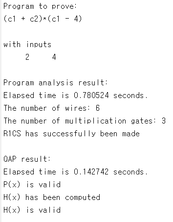
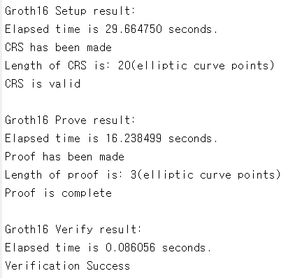
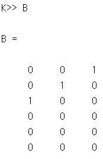
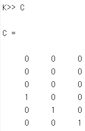
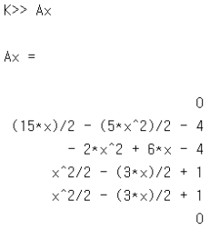
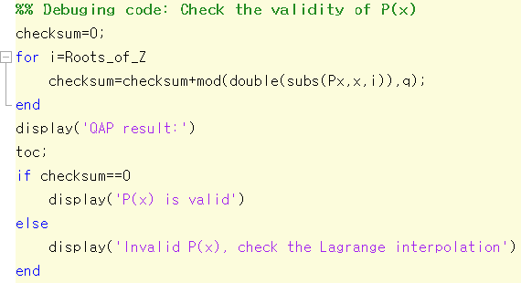
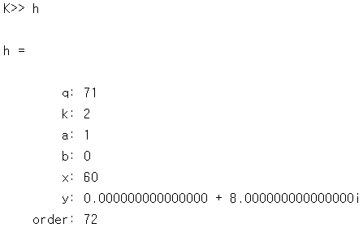

# 9. zk-SNARK: MATLAB 실습
> 작성자: 장재혁, [GIST 블록체인 인터넷 경제 연구센터 (센터장 이흥노)](https://infonet.gist.ac.kr/?page_id=6711)
>
> This work was created through a joint research with Onther Co., LTD., and supported by a grant-in-aid of Institute of Information & Communications Technology Planning & Evaluation (IITP), Republic of Korea.
>
> 이 글은 정보통신기획평가원(IITP)에서 연구비 지원을 받아 (주)온더와의 공동연구를 통해 만들어진 결과물이다.

저자는 소규모의 연산 프로그램에 대해 Groth16의 증명 프로토콜을 실습 할 수 있도록 도와주는 오픈소스 구현체를 제공하고 있다 (링크: [https://codeocean.com/capsule/8850121](https://codeocean.com/capsule/8850121)). 구현체는 MATLAB으로 구현되었으며, 링크를 통해 MATLAB이 설치되지 않은 PC에서도 실행이 가능하다. 먼저 program analysis와 QAP 등이 어떻게 구현되었는지 살펴 본 후, 간단한 예제를 통해 프로토콜을 수행해 보는 실습을 하겠다. 

구현 설명서
-----------

앞서 그림 5와 함께 살펴보았듯이, Groth16은 program analysis, QAP, ECC, 그리고 pairing의 과정을 거친다. Program analysis는 주어진 연산 프로그램 $$f$$를 연산조각들로 분해하는 과정이다. QAP는 연산조각들을 다항식과 계수의 집합으로 치환한다. 다항식과 계수를 조합하여 CRS와 증거를 생성한다. ECC는 증거를 암호화하여 증명 프로토콜의 건실성과 영지식성을 보장한다. Pairing은 증거가 암호화된 상태에서도 프로토콜이 완전성을 보장받을 수 있도록 한다. 

### *Program analysis의 구현*

프로토콜의 구성요소들 중 program analysis는 R1CS라는 방식으로 구현되었다[^1]. R1CS는 그림 6과 같은 써킷을 행렬연산 형태로 표현하는 것이다. 구체적으로, R1CS는 벡터 $$\mathbf[R}$$과 행렬 $$\mathbf[A}$$,$$\mathbf[B}$$,$$\mathbf[C}$$를 생성하고, 이들은 다음과 같은 관계를 만족한다: 
$$$$
[[\left[ \begin[matrix}
   [}  \\
   \mathbf[R}  \\
   [}  \\
\end[matrix} \right]}^[T}}\underbrace[\left[ \begin[matrix}
   [} & [} & [} & [}  \\
   [} & \mathbf[A} & [} & [}  \\
   [} & [} & [} & [}  \\
\end[matrix} \right]}_[m\times n}\circ [[\left[ \begin[matrix}
   [}  \\
   \mathbf[R}  \\
   [}  \\
\end[matrix} \right]}^[T}}\left[ \begin[matrix}
   [} & [} & [} & [}  \\
   [} & \mathbf[B} & [} & [}  \\
   [} & [} & [} & [}  \\
\end[matrix} \right]=[[\left[ \begin[matrix}
   [}  \\
   \mathbf[R}  \\
   [}  \\
\end[matrix} \right]}^[T}}\left[ \begin[matrix}
   [} & [} & [} & [}  \\
   [} & \mathbf[C} & [} & [}  \\
   [} & [} & [} & [}  \\
\end[matrix} \right],
$$$$
여기서 연산 $$\circ $$는 Hadamard 곱, 즉 성분별 곱(elementwise product)이며, 크기가 같은 두 벡터 혹은 두 행렬에 대하여 같은 크기의 벡터 혹은 행렬을 출력하고, 출력 벡터 혹은 행렬의 성분은 같은 위치의 입력 성분끼리 곱한 결과이다. 예를 들어, $$\left[ \begin[matrix}    1 & 2  \\ \end[matrix} \right]\circ \left[ \begin[matrix}    3 & 4  \\ \end[matrix} \right]=\left[ \begin[matrix}    3 & 8  \\ \end[matrix} \right]$$이다. 써킷에 존재하는 모든 곱셈 게이트에 대하여, 행렬 $$\mathbf[A}$$는 게이트의 왼쪽 입력, 행렬 $$\mathbf[B}$$는 게이트의 오른쪽 입력, 행렬 $$\mathbf[C}$$는 게이트의 출력이 기록되어 있으며, 행렬의 서로 다른 게이트의 정보는 서로 다른 열에 기록된다. 벡터 $$\mathbf[R}$$에는 써킷의 모든 곱셈 게이트의 중간 계산 값들이 기록된다. 즉, $$\mathbf[R}$$의 값들이 Groth16 프로토콜에서 사용되는 QAP 계수들 $$[[c}_[i}}$$이다. 따라서 각 행렬들의 크기는 $$m\times n$$이다. 예를 들어,  $$f:[[C}_[6}}=\left([[C}_[1}}+[[C}_[2}} \right)[[C}_[3}}[[C}_[4}}$$에 대응되는 써킷은 다음과 같은 R1CS 형태로 표현될 수 있다: 
$$$$
[[\underbrace[\left[ \begin[matrix}
   [[C}_[1}}  \\
   [[C}_[2}}  \\
   [[C}_[3}}  \\
   [[C}_[4}}  \\
   [[C}_[5}}  \\
   [[C}_[6}}  \\
\end[matrix} \right]}_[\mathbf[R}}}^[T}}\underbrace[\left[ \begin[matrix}
   0 & 1  \\
   0 & 1  \\
   1 & 0  \\
   0 & 0  \\
   0 & 0  \\
   0 & 0  \\
\end[matrix} \right]}_[\mathbf[A}}\circ [[\left[ \begin[matrix}
   [[C}_[1}}  \\
   [[C}_[2}}  \\
   [[C}_[3}}  \\
   [[C}_[4}}  \\
   [[C}_[5}}  \\
   [[C}_[6}}  \\
\end[matrix} \right]}^[T}}\underbrace[\left[ \begin[matrix}
   0 & 0  \\
   0 & 0  \\
   0 & 0  \\
   1 & 0  \\
   0 & 1  \\
   0 & 0  \\
\end[matrix} \right]}_[\mathbf[B}}=[[\left[ \begin[matrix}
   [[C}_[1}}  \\
   [[C}_[2}}  \\
   [[C}_[3}}  \\
   [[C}_[4}}  \\
   [[C}_[5}}  \\
   [[C}_[6}}  \\
\end[matrix} \right]}^[T}}\underbrace[\left[ \begin[matrix}
   0 & 0  \\
   0 & 0  \\
   0 & 0  \\
   0 & 0  \\
   1 & 0  \\
   0 & 1  \\
\end[matrix} \right]}_[\mathbf[C}}.
$$$$

식 (2)를 계산 해 보면, 첫 번째 열은 $$[[C}_[3}}[[C}_[4}}=[[C}_[5}}$$를 표현하며, 두 번째 열은 $$\left( [[C}_[1}}+[[C}_[2}} \right)[[C}_[5}}=[[C}_[6}}$$을 표현하기 때문에 $$\mathbf[R}$$,$$\mathbf[A}$$,$$\mathbf[B}$$,$$\mathbf[C}$$가 $$f$$의 한 써킷을 대변한다고 말할 수 있다. 한편, 주어진 연산 프로그램 $$f$$에 대하여, 써킷의 형태가 다양 할 수 있는 것과 마찬가지로 R1CS의 결과도 다양할 수 있다. 예를 들어,  $$f$$는 다음과 같은 R1CS로써 표현될 수도 있다: 
$$$$
	[[\left[ \begin[matrix}
   1  \\
   [[C}_[1}}  \\
   [[C}_[2}}  \\
   [[C}_[3}}  \\
   [[C}_[4}}  \\
   [[C}_[7}}  \\
   [[C}_[8}}  \\
   [[C}_[9}}  \\
   [[C}_[10}}  \\
   [[C}_[6}}  \\
\end[matrix} \right]}^[T}}\left[ \begin[matrix}
   0 & 0 & 0 & 0 & 0  \\
   1 & 0 & 0 & 0 & 0  \\
   0 & 0 & 1 & 0 & 0  \\
   0 & 0 & 0 & 0 & 0  \\
   0 & 1 & 0 & 1 & 0  \\
   0 & 0 & 0 & 0 & 0  \\
   0 & 0 & 0 & 0 & 1  \\
   0 & 0 & 0 & 0 & 0  \\
   0 & 0 & 0 & 0 & 1  \\
   0 & 0 & 0 & 0 & 0  \\
\end[matrix} \right]\circ [[\left[ \begin[matrix}
   1  \\
   [[C}_[1}}  \\
   [[C}_[2}}  \\
   [[C}_[3}}  \\
   [[C}_[4}}  \\
   [[C}_[7}}  \\
   [[C}_[8}}  \\
   [[C}_[9}}  \\
   [[C}_[10}}  \\
   [[C}_[6}}  \\
\end[matrix} \right]}^[T}}\left[ \begin[matrix}
   0 & 0 & 0 & 0 & 1  \\
   0 & 0 & 0 & 0 & 0  \\
   0 & 0 & 0 & 0 & 0  \\
   1 & 0 & 1 & 0 & 0  \\
   0 & 0 & 0 & 0 & 0  \\
   0 & 1 & 0 & 0 & 0  \\
   0 & 0 & 0 & 0 & 0  \\
   0 & 0 & 0 & 1 & 0  \\
   0 & 0 & 0 & 0 & 0  \\
   0 & 0 & 0 & 0 & 0  \\
\end[matrix} \right]=[[\left[ \begin[matrix}
   1  \\
   [[C}_[1}}  \\
   [[C}_[2}}  \\
   [[C}_[3}}  \\
   [[C}_[4}}  \\
   [[C}_[7}}  \\
   [[C}_[8}}  \\
   [[C}_[9}}  \\
   [[C}_[10}}  \\
   [[C}_[6}}  \\
\end[matrix} \right]}^[T}}\left[ \begin[matrix}
   0 & 0 & 0 & 0 & 0  \\
   0 & 0 & 0 & 0 & 0  \\
   0 & 0 & 0 & 0 & 0  \\
   0 & 0 & 0 & 0 & 0  \\
   0 & 0 & 0 & 0 & 0  \\
   1 & 0 & 0 & 0 & 0  \\
   0 & 1 & 0 & 0 & 0  \\
   0 & 0 & 1 & 0 & 0  \\
   0 & 0 & 0 & 1 & 0  \\
   0 & 0 & 0 & 0 & 1  \\
\end[matrix} \right].
$$$$

식 (2)의 R1CS와 식 (3)의 R1CS는 모두 $$f:[[C}_[6}}=\left( [[C}_[1}}+[[C}_[2}} \right)[[C}_[3}}[[C}_[4}}$$라는 같은 연산프로그램을 다르게 표현 한 것이다 ($$[[C}_[7}},[[C}_[8}},[[C}_[9}},[[C}_[10}}$$은 중간 계산 값이다).식 (3)의 R1CS는 식 (2)의 R1CS에 비해 행과 열의 개수가 더 많다. R1CS의 행의 개수는 써킷에 존재하는 선의 개수와 같으며, 열의 개수는 써킷에 존재하는 곱셈 게이트의 개수와 같다. 이전의 분석을 통해 써킷의 선과 곱셈 게이트가 많을수록 증거의 길이가 길어짐을 확인하였다. 따라서 식 (2)의 R1CS가 식 (3)보다 더 간결한 증거를 야기한다. 

### *QAP의 구현*

Program analysis (R1CS) 이후 QAP과정을 거쳐 다항식을 생성한다. QAP는 써킷의 구조를 다항식의 형태로 저장하는 것인데, 이전의 R1CS에서 이미 써킷의 구조를 행렬의 형태로 저장해 놓았다. 행렬 $$\mathbf[A}$$,$$\mathbf[B}$$,$$\mathbf[C}$$가 바로 그것이다. 따라서 QAP과정에서 해야 할 일은 행렬 $$\mathbf[A}$$,$$\mathbf[B}$$,$$\mathbf[C}$$를 다항식으로 변환하는 것이다. 먼저 임의의 근(root)들을 설정 한 후, 근 다항식 $$t\left( x \right)$$을 정의한다. 근의 개수는 R1CS 행렬의 열 개수와 일치하도록 정한다. 이제 행렬 $$\mathbf[A}$$,$$\mathbf[B}$$,$$\mathbf[C}$$ 각각의 행을 다항식으로 변환한다. 다항식의 입력 변수를 $$x$$ 출력 변수를 $$y$$라 할 때, 각각의 행의 성분들이 $$y$$의 표본이 되고, 근 다항식의 근들이 $$x$$의 표본이 되도록 설정한다. 이렇게 정의한 표본을 바탕으로 보간법을 수행하여 연속형태의 다항식을 생성한다. 이 과정을 모든 행렬의 모든 $$3m$$개의 행에 대하여 반복하여 총 $$3m$$개의 다항식을 보간법으로 생성한다. 예를 들어, 식 (2)의 R1CS인 경우 근의 개수는 2개이며, 각각의 근을 $$[[r}_[1}}=1$$, $$[[r}_[2}}=2$$와 같이 설정 할 수 있다. 그러면 근 다항식은 $$t\left( x \right)=\left( x-1 \right)\left( x-2 \right)$$가 된다. 예를 들어 행렬 $$\mathbf[B}$$의 네 번째 행에 대응되는 다항식을 생성하는 경우, 표본은 $$\left( 1,1 \right),\left( 2,0 \right)$$이며, 이 두 개의 표본을 바탕으로 보간법을 수행한다. 

보간법은 선형대수를 사용하여 수행 할 수 있다. 번호 $$i=1,\cdots ,n$$에 대하여 근 다항식의 근을 $$[[r}_[i}}$$라 명명하겠다. 여기서 근의 개수는 써킷의 곱셈 게이트의 개수 $$n$$과 같다. 어떤 QAP 다항식 $$y=[[a}_[0}}+[[a}_[1}}x+[[a}_[2}}[[x}^[2}}+\cdots +[[a}_[n-1}}[[x}^[n-1}}$$ 에 대해 $$n$$개의 보간 표본이 $$\left( [[r}_[1}},[[y}_[1}} \right),\left( [[r}_[2}},[[y}_[2}} \right),\cdots ,\left( [[r}_[n}},[[y}_[n}} \right)$$일 때, 표본의$$x$$성분 과 $$y$$성분 사이에는 다음과 같은 선형 관계가 성립된다: 
$$$$
\left[ \begin[matrix}
   [[y}_[1}}  \\
   [[y}_[2}}  \\
   \vdots   \\
   [[y}_[n}}  \\
\end[matrix} \right]=\underbrace[\left[ \begin[matrix}
   [[r}_[1}}^[0} & [[r}_[1}} & \cdots  & [[r}_[1}}^[n-1}  \\
   [[r}_[2}}^[0} & [[r}_[2}} & \cdots  & [[r}_[2}}^[n-1}  \\
   \vdots  & \vdots  & \vdots  & \vdots   \\
   [[r}_[n}}^[0} & [[r}_[n}} & \cdots  & [[r}_[n}}^[n-1}  \\
\end[matrix} \right]}_[\mathbf[V}}\left[ \begin[matrix}
   [[a}_[0}}  \\
   [[a}_[1}}  \\
   \vdots   \\
   [[a}_[n-1}}  \\
\end[matrix} \right].
$$$$

이때 전달행렬 $$\mathbf[V}$$가 Vandermonde 행렬[^2]이라는 특수한 형태가 되고, Vandermonde 행렬은 항상 역행렬이 존재한다. 이제 연속 다항식의 계수 $$[[a}_[0}},\cdots ,[[a}_[n}}$$을 찾는 보간법은 다음의 선형 역문제를 푸는 것이다: 
$$$$
	\left[ \begin[matrix}
   [[a}_[0}}  \\
   [[a}_[1}}  \\
   \vdots   \\
   [[a}_[n-1}}  \\
\end[matrix} \right]=[[\mathbf[V}}^[-1}}\left[ \begin[matrix}
   [[y}_[1}}  \\
   [[y}_[2}}  \\
   \vdots   \\
   [[y}_[n}}  \\
\end[matrix} \right].
$$$$

근 다항식의 근 $$[[r}_[i}}$$는 $$i=1,\cdots ,n$$에 대해 서로 다르기만 하다면 임의로 설정하여도 문제가 없지만, 보간법을 더 계산효율적으로 수행하기 위해 특수하게 설정하는 경우도 있다. 전달행렬 $$\mathbf[V}$$는 특수성으로 인해 언제나 역행렬 $$[[\mathbf[V}}^[-1}}$$가 존재하기는 하지만, $$[[\mathbf[V}}^[-1}}$$를 계산하는 것은 여전히 많은 계산 량을 필요로 한다. 계산 량을 줄이기 위해, 다항식의 근을 적절히 설정하여 행렬 $$\mathbf[V}$$를 DFT 행렬로 만들 수 있다. DFT행렬이란 Vandermonde 행렬의 특수한 경우로, $$k,l$$번째 성분이 $$[[e}^[j2\pi \frac[kl}[n}}}$$인 행렬이다. 근 다항식의 근들을 $$i=1,\cdots ,n$$에 대해 $$[[r}_[i}}=[[e}^[j2\pi \frac[i}[n}}}$$로 설정하면 $$\mathbf[V}$$를 DFT 행렬로 만들 수 있다. 여기서 $$j=\sqrt[-1}$$는 허수이다. $$\mathbf[V}$$가 DFT 행렬이 되면 좋은 점은 fast Fourier transform(FFT)[^3] 알고리즘을 사용 할 수 있게 된다는 것이며, 그러면 의 역문제를 $$O\left( n\log n \right)$$이라는 아주 적은 계산 량으로 풀 수 있다. 

### *ECC의 구현*

MATLAB 구현체에서 ECC를 위해 사용하는 타원곡선은 $$E:[[y}^[2}}=[[x}^[3}}+x$$이며, $$x$$와 $$y$$는 유한 체 $$[[F}_[p}}$$에서 정의되었다. 여기서 체의 크기는 $$p=71$$이다. 이렇게 정의된 타원곡선 $$E$$는 supersingular 타원곡선[^4]이라 불리며, pairing에 유리한 특성을 가지고 있다. 

타원곡선 $$E$$를 pairing에 조금 더 유리하게 사용하기 위해서 확장 체 (extension field)의 개념을 함께 사용한다. 유한 체 $$[[F}_[p}}$$의 order가 2인 확장 체는 $$[[F}_[[[p}^[2}}}}$$으로 표기된다. 한 예로, 확장체는 $$[[F}_[p}}$$의 원소에 허수인 $$j=\sqrt[-1}$$의 사용을 허용함으로써 확장 가능하다. 예를 들어, $$[[F}_[3}}=\left\[ 0,1,2 \right\}$$의 확장 체는 $$[[F}_[[[3}^[2}}}}=\left\[ 0,1,2,j,j2,1+j,1+j2,2+j,2+j2 \right\}$$일 수 있다. 만약 $$[[F}_[p}}\times [[F}_[p}}$$의 한 원소인 $$\left( x,y \right)$$가 타원곡선 $$E$$상의 한 점이라면, $$\left( -x,jy \right)$$또한 타원곡선 $$E$$상의 한 점인 것을 알 수 있다. 그리고 그 점 $$\left( -x,jy \right)$$는 $$[[F}_[[[p}^[2}}}}\times [[F}_[[[p}^[2}}}}$$의 한 원소라는 것을 알 수 있다. 다시 말하면, $$[[F}_[p}}$$상에서 정의된 $$E$$의 점들을 $$[[F}_[[[p}^[2}}}}$$으로 확장하는 것은 간단히 수행 가능하다. 

Groth16의 증명 프로토콜에서는 타원곡선 $$E$$의 점들 중 두 개의 generator인 $$G$$와 $$H$$를 사용한다. MATLAB 구현체에서도 $$G$$와 $$H$$를 사용하며, pairing에 유리하도록 사용하기 위해 $$G$$와 $$H$$가 다음과 같은 관계가 되도록 선택하였다: $$G$$는 타원곡선 $$E$$의 generator들 중 임의로 선택되었다: $$G=\left( [[x}_[G}},[[y}_[G}} \right)$$라 할 때, $$H=\left( -[[x}_[G}},j[[y}_[G}} \right)$$이다. 따라서 $$G\in [[F}_[p}}\times [[F}_[p}}$$이고 $$H\in [[F}_[[[p}^[2}}}}\times [[F}_[[[p}^[2}}}}$$이다. 

### *Pairing의 구현*

Pairing은 Weil pairing을 구현하였다. 다른 pairing들인 Ate pairing, Tate pairing도 모두 Weil pairing의 계산원리에서 조금만 변형하면 구현이 가능하다. Weil pairing은 D. Boneh와 M. Franklin의 논문인 "Identity-based encryption from the Weil pairing"[^5]의 Appendix에 기술된 정의와 계산 방법을 그대로 사용하여 구현하였다. 이 때, 효율적인 계산을 위해 Miller algorithm[^6]이 사용된다. 특이사항으로, $$O\left( [[p}^[-1}}\log p \right)$$의 확률로 pairing에 실패 할 수 있다. 그러나 $$p$$가 커질수록 이 확률은 매우 작아져서 실용적인 환경에서는 실패 하는 경우가 거의 없고, 만약 실패하더라도 다시 시도하면 된다. 

Groth16 증명 프로토콜 사용 예제
-------------------------------

그림 9은 MATLAB으로 구현된 Groth16 프로콜의 실행 결과이다. 연산 프로그램은 $$f:y=\left( [[c}_[1}}+[[c}_[2}} \right)\left( [[c}_[1}}-4 \right)$$이다. 비공개 정보는 $$[[c}_[1}}=2$$과 $$[[c}_[2}}=4$$이다. Program analysis (R1CS) 결과로 6개의 써킷 선과 3개의 곱셈 게이트가 형성되었다. R1CS의 결과를 토대로 QAP 다항식들과 복원 다항식 $$p\left( x \right)$$, 몫 다항식 $$h\left( x \right)$$를 성공적으로 생성하였다. 보안 파라미터와 QAP 결과를 종합하여 CRS와 증거를 성공적으로 생성하였고, CRS의 길이는 $$3n+m+5=20$$이며, 증거의 길이는 $$3$$이다. CRS와 증거를 사용하여 검증이 성공적으로 수행되었다. 

|                                                              |                                                              |
| ------------------------------------------------------------ | ------------------------------------------------------------ |
| [width="2.8442629046369206in" height="3.634336176727909in"} | [width="3.3792683727034123in" height="3.2540988626421696in"} |
그림9  MATLAB으로 구현된 Groth16 증명 프로토콜의 실행 결과

R1CS의 결과로 생성된 행렬 $$\mathbf[A}$$,$$\mathbf[B}$$,$$\mathbf[C}$$와 벡터 $$\mathbf[R}$$은 각각 다음과 같다:

|                                                              |                                                              |                                                              |                                                              |
| ------------------------------------------------------------ | ------------------------------------------------------------ | ------------------------------------------------------------ | ------------------------------------------------------------ |
| [width="1.443989501312336in" height="2.221519028871391in"} | [width="1.4439884076990377in" height="2.221519028871391in"} | [width="1.4439884076990377in" height="2.221519028871391in"} | [width="0.5632906824146982in" height="2.1366174540682414in"} |
그림 10 R1CS로 생성된 행렬 A,B,C와 벡터 R

그림 10에서 생성된 $$\mathbf[R}$$은 $$\mathbf[R}\left( [[c}_[1}},[[c}_[2}} \right)=\left[ 1,[[c}_[1}},[[c}_[2}},[[c}_[3}}=[[c}_[1}}[[c}_[2}},[[c}_[4}}=[[c}_[1}}^[2},y=-4[[c}_[2}}-4[[c}_[1}}+[[c}_[3}}+[[c}_[4}} \right]$$에 각각 $$[[c}_[1}}=2$$와 $$[[c}_[2}}=4$$를 대입한 결과이다. $$\mathbf[R}\left( [[c}_[1}},[[c}_[2}} \right)$$와 행렬 $$\mathbf[A}$$,$$\mathbf[B}$$,$$\mathbf[C}$$를 사용하여 식 (1)을 계산한 후 왼쪽 열부터 읽으면 다음의 관계식들을 순서대로 얻을 수 있다: 
$$$$
	\left\[ \begin[matrix}
   [[c}_[1}}[[c}_[2}}=[[c}_[3}},  \\
   [[c}_[1}}^[2}=[[c}_[4}},  \\
   -4[[c}_[1}}-4[[c}_[2}}+[[c}_[3}}+[[c}_[4}}=y.  \\
\end[matrix} \right.
$$$$

관계식 (6)은 연산 프로그램 $$f:[[C}_[6}}=\left( [[C}_[1}}+[[C}_[2}} \right)[[C}_[3}}[[C}_[4}}$$와 일치하므로, R1CS가 성공적으로 수행되었음을 알 수 있다. 

QAP를 수행하기 위해, 근 다항식 $$t\left( x \right)$$의 근을 $$[[r}_[1}}=1$$, $$[[r}_[2}}=2$$, $$[[r}_[3}}=3$$으로 설정하였다. 따라서 $$t\left( x \right)=\left( x-1 \right)\left( x-2 \right)\left( x-3 \right)$$이다. 행렬 $$\mathbf[A}$$의 두 번째 행에 대응되는 다항식, 즉 $$[[w}_[2}}\left( x \right)$$의 표본은 $$\left( 1,1 \right),\left( 2,1 \right),\left( 3,-4 \right)$$이며, 보간법을 적용한 결과는 $$[[w}_[2}}\left( x \right)=-2.5[[x}^[2}}+7.5x-4$$로 계산되었다. 마찬가지로, 행렬 $$\mathbf[C}$$의 4번째 행에 대응되는 다항식, 즉 $$[[y}_[4}}\left( x \right)$$의 표본은 $$\left( 1,0 \right),\left( 2,0 \right),\left( 3,0 \right)$$이며, 보간법을 적용한 결과는 $$[[y}_[4}}\left( x \right)=0.5[[x}^[2}}-1.5x+1$$로 계산되었다. 이러한 방법으로 $$i=1,\cdots ,6$$에 대하여 모든 다항식 $$[[w}_[i}}\left( x \right)$$, $$[[v}_[i}}\left( x \right)$$, $$[[y}_[i}}\left( x \right)$$를 생성하였다 (그림 11). 이를 토대로 $$p\left( x \right)$$를 계산하였고, 마지막으로 $$h\left( x \right)=[p\left( x \right)}/[t\left( x \right)}\;$$를 계산하였다. $$p\left( x \right)$$에 $$k=1,\cdots ,3$$에 대하여 $$x=[[r}_[k}}$$를 대입한 후 $$p\left( [[r}_[k}} \right)=0$$임을 확인하여 QAP의 결과가올 바른지 확인하였다 (그림 12). 

|                                                              |                                                              |                                                              |                                                              |
| ------------------------------------------------------------ | ------------------------------------------------------------ | ------------------------------------------------------------ | ------------------------------------------------------------ |
| [width="1.5409831583552056in" height="1.6803280839895014in"} | [width="1.5409831583552056in" height="1.6803280839895014in"} | [width="1.5409831583552056in" height="1.6803280839895014in"} | [width="0.733911854768154in" height="0.850515091863517in"} |
그림 11 QAP 왼쪽부터 다항식 $$[[w}_[i}}\left( x \right)$$, $$[[v}_[i}}\left( x \right)$$, $$[[y}_[i}}\left( x \right)$$와 몫 다항식 $$h\left( x \right)$$의 계산 결과. 행렬 $$\text[Ax}$$ 와 $$\text[Bx}$$, $$\text[Cx}$$의 첫 번째 행부터 마지막 행까지 순서대로 $$i=1,\cdots ,6$$에 대응된다.

[width="4.299563648293963in"
height="2.344261811023622in"}
그림 12 복원 다항식 $$p\left( x \right)$$가 올바르게 생성되었는지 확인하는 코드

한편 MATLAB으로 구현한 Groth16 프로토콜의 QAP는 유한 체 $$[[F}_[q}}$$에서 작동한다. 여기서 $$q=[[p}^[2}}-1$$이다[^7]. 따라서 QAP 다항식들의 계수들이 $$[[F}_[q}}$$의 원소여야 한다. 따라서 $$i=1,\cdots ,6$$에 대한 모든 다항식 $$[[w}_[i}}\left( x \right)$$, $$[[v}_[i}}\left( x \right)$$, $$[[y}_[i}}\left( x \right)$$의 계수들에 존재하는 유리수들을 정수로 변환하기 위해 임의의 상수 $$u$$를 사용 할 수 있다. 이때 $$u$$는 모든 계수들의 분모의 최소 공배수이다. QAP의 완전성을 위한 관계식인 $$\left( \sum\nolimits_[i=1}^[6}[[[c}_[i}}[[w}_[i}}\left( x \right)} \right)\cdot \left( \sum\nolimits_[i=1}^[6}[[[c}_[i}}[[v}_[i}}\left( x \right)} \right)-\left( \sum\nolimits_[i=1}^[6}[[[c}_[i}}[[y}_[i}}\left( x \right)} \right)=h\left( x \right)t\left( x \right)$$의 관계를 유지하면서 다항식의 계수들을 정수로 변환하는 방법은 $$[[w}_[i}}\left( x \right)\leftarrow u[[w}_[i}}\left( x \right)$$, $$[[v}_[i}}\left( x \right)=u[[v}_[i}}\left( x \right)$$, $$[[y}_[i}}\left( x \right)=[[u}^[2}}[[y}_[i}}\left( x \right)$$, $$h\left( x \right)\leftarrow [[u}^[2}}h\left( x \right)$$로 변환하는 것이다. 이렇게 하면 
$$$$
\nonumber \left(
u\sum\nolimits_[i=1}^[6}[[[c}_[i}}[[w}_[i}}\left( x \right)}
\right)\cdot \left(
u\sum\nolimits_[i=1}^[6}[[[c}_[i}}[[v}_[i}}\left( x \right)}
\right)-\left(
[[u}^[2}}\sum\nolimits_[i=1}^[6}[[[c}_[i}}[[y}_[i}}\left( x
\right)} \right)=[[u}^[2}}h\left( x \right)t\left( x \right)
$$$$
이 되어 QAP의 완전성이 유지된다.

[width="2.076473097112861in"
height="1.7950820209973752in"}
그림 13 유리수 계수들의 분모의 최소공배수를 곱하여 계수를 정수로 변환하는 코드

QAP 결과를 ECC로 암호화하기에 앞서, 먼저 타원곡선의 두 generator로 사용될 $$G$$와 $$H$$를 선택하였다. $$G$$의 좌표는 $$\left( 11,8 \right)$$이고, $$H$$의 좌표는 $$\left( -11\bmod 71,j8\bmod 71 \right)=\left( 60,j8 \right)$$이다 (그림 14). 타원 곡선의 모든 점과 각 점의 특성은 링크 https://graui.de/code/elliptic2/> 에서 확인 할 수 있으며, MATLAB 구현체에서도 주어진 타원 곡선의 모든 점을 찾는 함수(*EC_points.m*)와 generator를 찾는 함수(*EC_order.m*)가 제공된다. 

|                                                              |                                                              |
| ------------------------------------------------------------ | ------------------------------------------------------------ |
| [width="0.9090912073490813in" height="2.127869641294838in"} | [width="3.0983398950131233in" height="1.9818186789151355in"} |
그림 14 Generator G와 H

준비된 QAP 결과와 타원곡선을 사용하여, Groth16 프로토콜의 Setup, Prove, Verify를 순서대로 수행한다. Setup과정과 Prove과정에서 선택되는 파라미터인 $$\tau $$와 $$r,s$$는 매번 무작위로 선택되도록 설계되었다. Setup 과정에서 CRS 데이터인 길이 14의 $$[[\sigma }_[G}}$$와 길이 6의 $$[[\sigma }_[H}}$$를 생성하며, 구현체에서는 $$[[\sigma }_[G}}$$가 sigma1_1, sigma1_2, …, sigma1_5에, 그리고 $$[[\sigma }_[H}}$$가 sigma2_1, sigma2_2에 분리되어 저장된다. Prove 과정에서는 길이 3의 증거 $$\pi $$를 생성하며, 구현체에서는 proof로 명명되었다. Verify 과정에서 계산되는 $$LHS$$와 $$RHS$$는 모두 $$[[F}_[p}}$$의 원소이며, $$LHS=RHS$$임을 확인하여 최종 검증결과를 출력한다. 

최종 검증결과는 그림 9와 같으며, Groth16 프로토콜의 모든 과정이 성공적으로 수행되었음을 알 수 있다.

[^1]: R1CS는 이더리움의 github에 python으로도 구현되어있다: <https://github.com/ethereum/research/blob/master/zksnark/code_to_r1cs.py>
[^2]: Vandermonde 행렬: https://en.wikipedia.org/wiki/Vandermonde_matrix
[^3]: Fast Fourier transform: https://en.wikipedia.org/wiki/Fast_Fourier_transform
[^4]: $$p$$의 값은 $$p\equiv 3\bmod 4$$를 만족시키는 선에서 조절 가능하다. Supersingular elliptic curves에 관한 설명은 다음의 문헌에서 참조할 수 있다: D. Boneh and M. Franklin, "Identity-based encryption from the Weil pairing," in *SIAM J. of Computing*, 2003.
[^5]: D. Boneh and M. Franklin, "Identity-based encryption from the Weil pairing," in *SIAM J. of Computing*, 2003.
[^6]: V. S. Miller, "The Weil Pairing, and Its Efficient Calculation," *Journal of Cryptology*, 2004.
[^7]: QAP가 $$[[F}_[q}}$$에서 작동하면, $$[[F}_[[[p}^[2}}}}$$에서 정의된 타원곡선 점들의 pairing을 사용하여 QAP의 완전성, 즉 $$p\left(x \right)=h\left( x \right)t\left( x \right)$$를 검증 할 수 있다.
